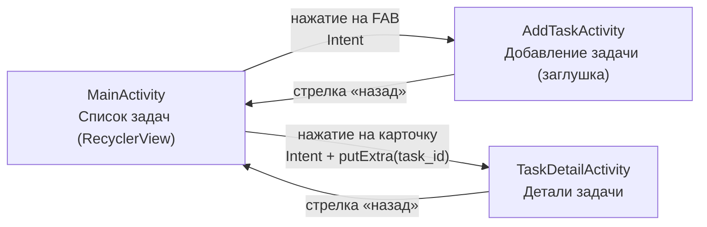

# Схема экранов приложения (этап 2)

| Экран | Класс | Назначение |
|---|---|---|
| Главный | `ui/MainActivity` | Список задач в `RecyclerView`, FAB «добавить» |
| Добавление | `ui/AddTaskActivity` | Пока пустая заглушка (форма — этап 5) |
| Детали | `ui/TaskDetailActivity` | Принимает `EXTRA_TASK_ID`, показывает название, дату, статус, описание |

> В дальнейших этапах добавятся: форма редактирования (этап 5), календарь (этап 6), настройки (этап 8).
